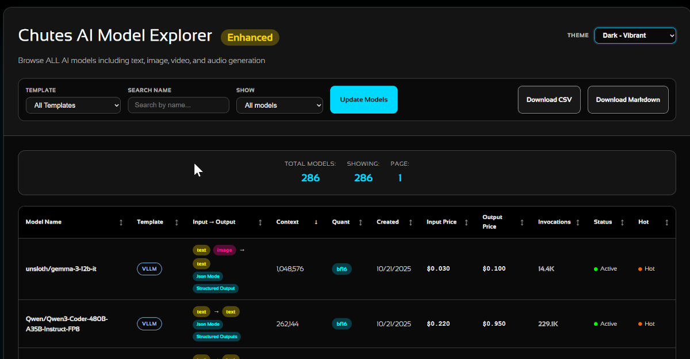

[](public/og-image.png)

[Live Version](https://extra.wuu73.org/chu/)

# Chutes AI Model Explorer - Enhanced Version

This is an enhanced version of the Chutes AI Model Explorer that includes:

- **Complete model information** from the `/chutes/` endpoint
- **Image, video, and audio generation models**
- **Model schemas and templates**
- **Instance status and verification**
- **Detailed pricing information** (USD and TAO)
- **GPU requirements and availability**
- **Invocation counts and popularity metrics**
- **Context Window Size**

## Key Differences from Basic Version

The basic version (`chutes-models/`) uses the public `/v1/models` endpoint which:
- ✅ Works without API key
- ❌ Shows only text generation models
- ❌ Limited metadata

This enhanced version uses the `/chutes/` endpoint which:
- ✅ Shows ALL models (image, video, audio, text)
- ✅ Complete metadata and pricing
- ✅ Instance status and GPU info
- ⚠️ Requires API key (server-side only)

## Setup

1. **Install dependencies:**
   ```bash
   npm install
   ```

2. **Configure your API key:**
   Create a `.env` file in this directory:
   ```env
   CHUTES_API_KEY=your-api-key-here
   PORT=3000
   ```

3. **Start the server:**
   ```bash
   npm start
   ```

4. **Open in browser:**
   Navigate to `http://localhost:3000`

## Security Note

⚠️ **IMPORTANT**: This version includes a Node.js backend server to keep your API key secure. Never expose your API key in client-side JavaScript!

## Features

### Smart Caching System 💾
- **3-10 minute cache** for API responses
- Reduces API calls by **80-95%**
- Multiple users share cached data
- See [CACHING.md](CACHING.md) for details

### Model Filtering
- Filter by model type (text, image, video, audio)
- Filter by template (vllm, comfyui, etc.)
- Search by name or slug

### Sorting
- Sort by price (input/output)
- Sort by popularity (invocation count)
- Sort by GPU type
- Sort by availability

### Additional Information
- Instance verification status
- Regional availability
- Hot/cold model status
- Supported GPU types
- Model versioning
